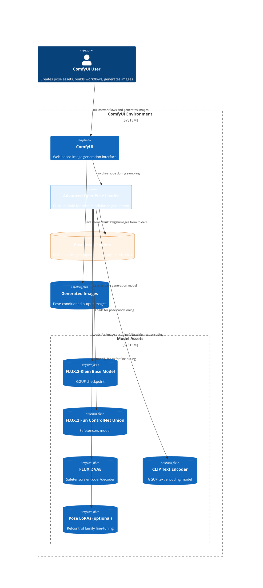

# System Context: Advanced OpenPose Loader

## Diagram

## Elements

| ID | Name | Type | Description |
|----|------|------|-------------|
| user | ComfyUI User | Person | Creates pose assets, builds workflows, generates images |
| comfyui | ComfyUI | System | Web-based image generation interface |
| advanced_loader | Advanced OpenPose Loader | System | Custom node for pose-conditioned generation |
| base_model | FLUX.2-Klein Base Model | SystemDb | GGUF checkpoint (e.g., Miraclein 4.3 9B Q8) |
| controlnet_model | FLUX.2 Fun ControlNet Union | SystemDb | Safetensors model for pose conditioning |
| vae_model | FLUX.2 VAE | SystemDb | Safetensors encoder/decoder |
| clip_model | CLIP Text Encoder | SystemDb | GGUF text encoding model |
| lora_models | Pose LoRAs (optional) | SystemDb | Refcontrol family fine-tuning |
| pose_assets | Pose Asset Folders | SystemDb | PNG pose images (six types per pose) |
| output_images | Generated Images | SystemDb | Pose-conditioned output images |

## Notes

System context view showing the Advanced OpenPose Loader node's position within the broader ComfyUI environment and its dependencies.
