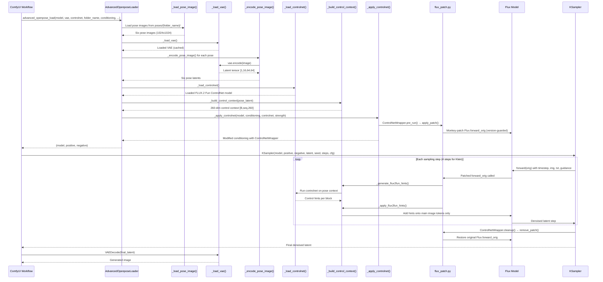

# Sampling Sequence: Advanced OpenPose Loader

## Diagram

## Notes

Complete sequence diagram showing the pose-conditioned image generation flow from workflow invocation through sampling to final image output. Highlights the scoped monkey-patch lifecycle and the dual-mechanism approach.
