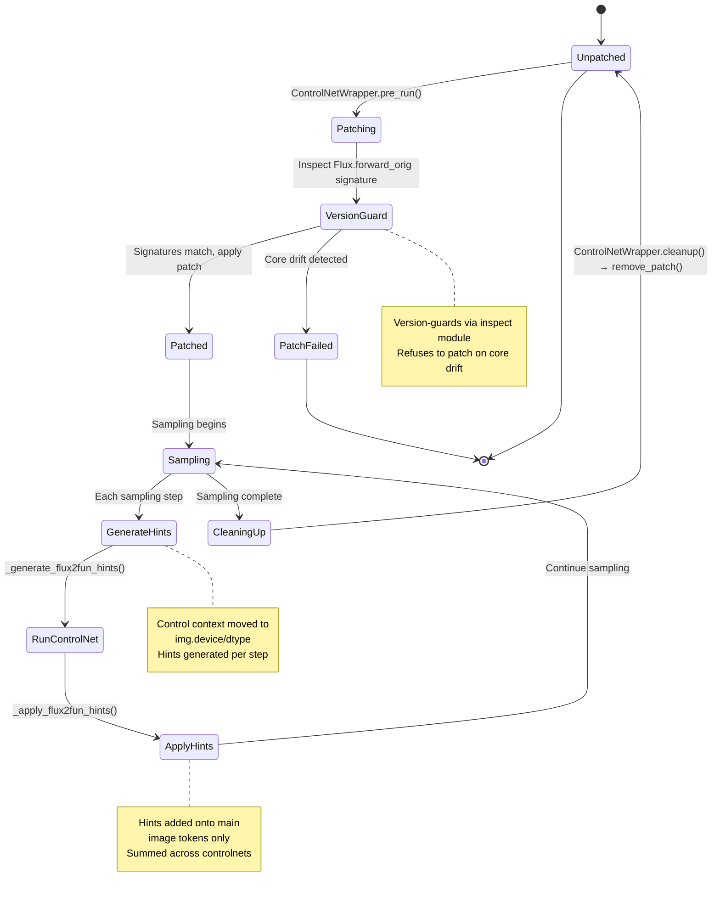

# Flux Patch Lifecycle

## Diagram

## Notes

State diagram showing the complete lifecycle of the scoped monkey-patch applied to Flux.forward_orig. Highlights the version-guard mechanism that ensures compatibility with ComfyUI core updates.
