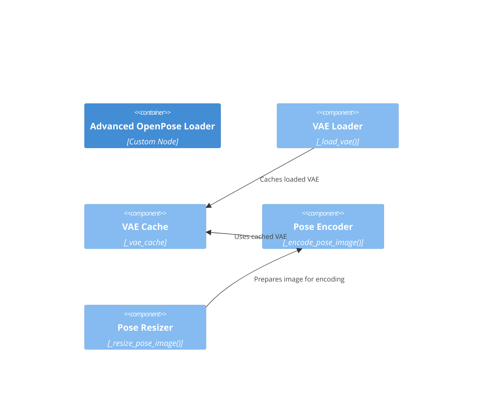

# Component: VAE Encoder

## Diagram

## Elements

| ID | Name | Type | Description |
|----|------|------|-------------|
| advanced_loader | Advanced OpenPose Loader | Container | Parent custom node |
| vae_loader | VAE Loader | Component | `_load_vae()` method — loads flux2-vae.safetensors |
| vae_cache | VAE Cache | Component | `_vae_cache` — internal cache for loaded VAE |
| pose_encoder | Pose Encoder | Component | `_encode_pose_image()` — encodes pose images to latent space |
| resizer | Pose Resizer | Component | `_resize_pose_image()` — resizes to 1024×1024 |

## Notes

Encapsulates all VAE-related operations. The VAE is loaded once, cached, and reused across runs. Pose images are resized to 1024×1024 before encoding.
