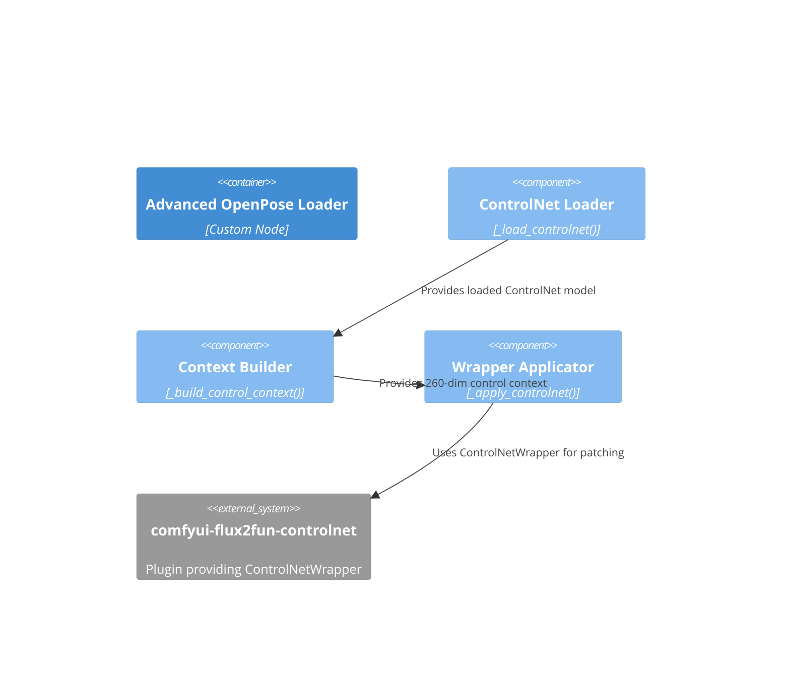

# Component: ControlNet Wrapping

## Diagram

## Elements

| ID | Name | Type | Description |
|----|------|------|-------------|
| advanced_loader | Advanced OpenPose Loader | Container | Parent custom node |
| cn_loader | ControlNet Loader | Component | `_load_controlnet()` — loads FLUX.2 Fun ControlNet model |
| context_builder | Context Builder | Component | `_build_control_context()` — builds 260-dim control context |
| wrapper_applicator | Wrapper Applicator | Component | `_apply_controlnet()` — applies ControlNetWrapper with strength inversion |
| flux2fun | comfyui-flux2fun-controlnet | System_Ext | External plugin providing ControlNetWrapper |

## Notes

Encapsulates ControlNet loading, context construction, and wrapper application. The strength inversion (1.0 - user_strength) happens here. The plugin's scoped monkey-patch lifecycle is triggered via the wrapper.
