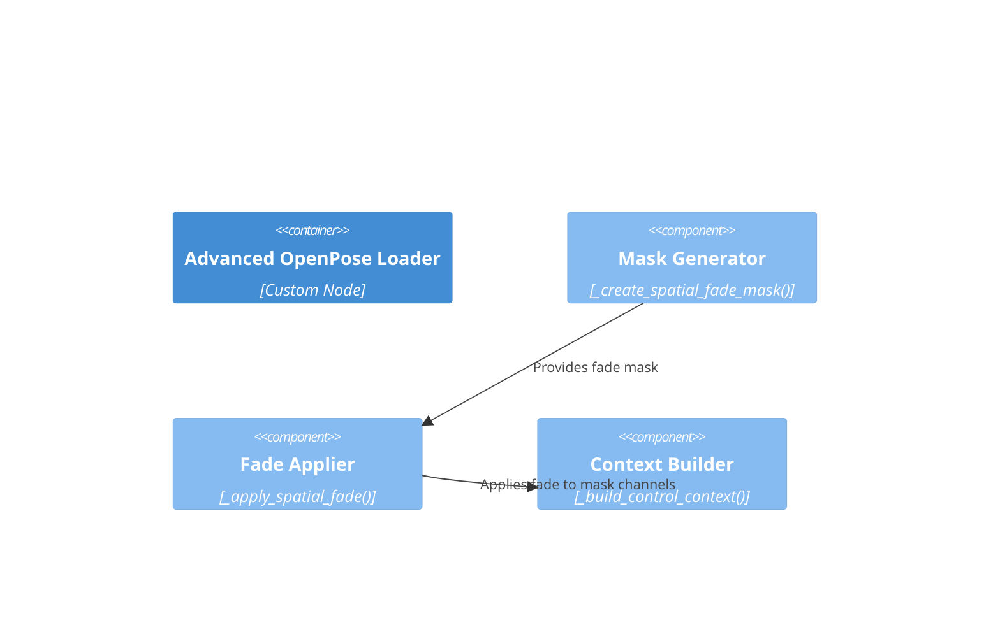

# Component: Spatial Fade

## Diagram

## Elements

| ID | Name | Type | Description |
|----|------|------|-------------|
| advanced_loader | Advanced OpenPose Loader | Container | Parent custom node |
| mask_generator | Mask Generator | Component | `_create_spatial_fade_mask()` — generates linear gradient mask (top/bottom/left/right) |
| fade_applier | Fade Applier | Component | `_apply_spatial_fade()` — applies fade mask to control context |
| context_builder | Context Builder | Component | `_build_control_context()` — receives masked context |

## Notes

Encapsulates spatial fade mask generation and application. Computes linear gradients on the 4 mask channels of the 260-dim control context.
