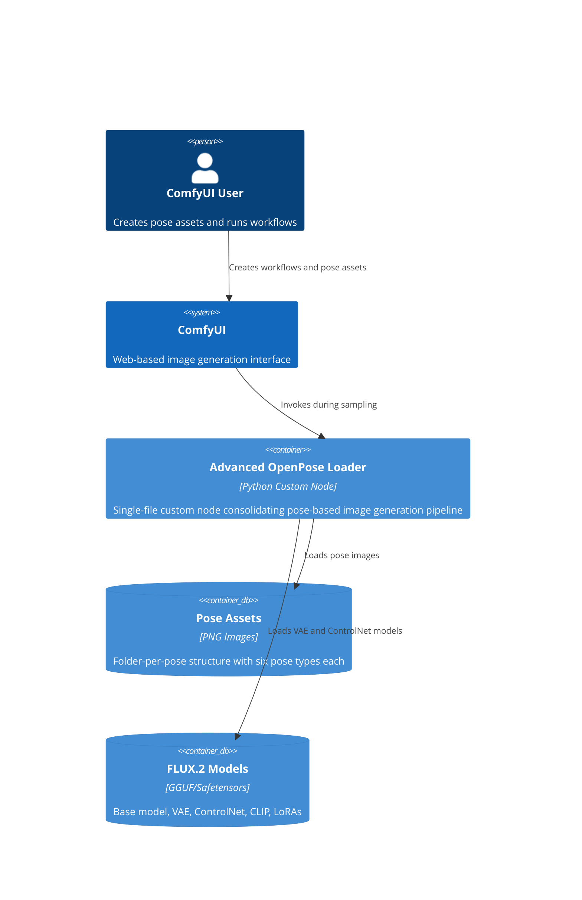

# Container: Advanced OpenPose Loader Custom Node

## Diagram

## Elements

| ID | Name | Type | Technology | Description |
|----|------|------|------------|-------------|
| user | ComfyUI User | Person | — | Creates pose assets and runs workflows |
| comfyui | ComfyUI | System | — | Web-based image generation interface |
| advanced_loader | Advanced OpenPose Loader | Container | Python Custom Node | Single-file custom node consolidating pose-based image generation pipeline |
| pose_assets | Pose Assets | ContainerDb | PNG Images | Folder-per-pose structure with six pose types each |
| flux_models | FLUX.2 Models | ContainerDb | GGUF/Safetensors | Base model, VAE, ControlNet, CLIP, LoRAs |

## Notes

The custom node itself is a container within ComfyUI. It manages its own internal state (VAE cache, ControlNet model) and exposes a simple interface to the ComfyUI workflow system.
